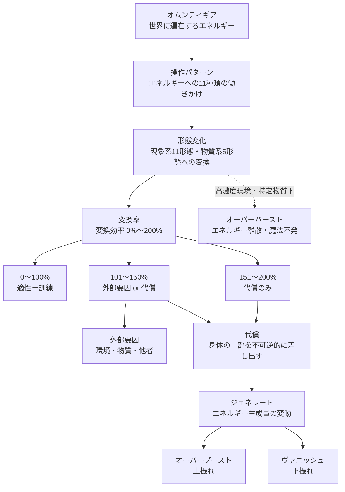

## 1. 概要

### 1.1 定義

| 項目   | 内容                                    |
| ---- | ------------------------------------- |
| 正式名称 | オムンティギア（Omntigia）                     |
| 語源   | Omnia（全て）+ Essentia（本質）+ Energia（活動力） |
| 意味   | 全てに遍在する、本質的なエネルギー                     |
| 位置づけ | 世界の法則のひとつ                             |
| 存在形態 | 世界全体に遍在する                             |

### 1.2 基本原理

オムンティギアはエネルギーそのものであり、特別でも神秘的でもない。酸素のように世界に当たり前に存在する。

生物がこのエネルギーに作用を加えることで、様々な現象や物質への変換が可能となる。いわゆる「魔法」と呼ばれるものは、このエネルギー変換である。

### 1.3 体系の全体像

オムンティギアの体系は、エネルギーの存在から実際の運用、そしてその代価までを一貫して扱う。以下に全体の構造を示す。

---
