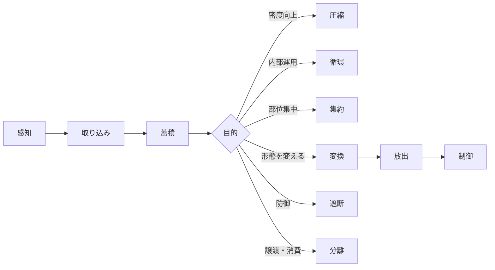

## 2. 操作パターン

生物がオムンティギアに対して行える操作は以下の11種類。

|操作|内容|補足|
|---|---|---|
|感知|周囲のオムンティギアの存在・濃度を感じ取る|操作の前提となる能力|
|取り込み|周囲のオムンティギアを体内に吸収する|呼吸のようなもの|
|蓄積|体内にオムンティギアを溜め込む|容量には個人差|
|圧縮|蓄積したエネルギーを凝縮する|密度を上げる|
|循環|体内でオムンティギアを巡らせる|維持・活性化|
|集約|特定の部位や場所に集める|手元、足先など|
|放出|体外にオムンティギアを出す|出力|
|変換|作用を加えて別の形態にする|熱、水、風など|
|遮断|オムンティギアの流れを止める・弾く|防御的な使い方|
|制御|放出後のオムンティギアを操る|軌道変更など|
|分離|体内のオムンティギアを切り離す|消費・譲渡|

### 2.1 操作パターンの適性

操作パターンの使用には適性が必要である。適性がない操作は使用できないが、形態変化と同様に訓練によって獲得できる可能性がある。

なお、感知の適性が0%であっても、オムンティギアの存在自体は漠然と感じ取れる。適性0%の状態とは、感じ取ったものが何であるかを認識・識別できない状態を指す。

### 2.2 操作の順序性

操作パターンは同時に複数を実行することはできない。一つの操作を完了してから次の操作に移る順序実行である。これは形態変化の同時発動禁止と同じ原則に基づく。

実際の運用においては、感知から始まり、必要な操作を順序立てて実行する。以下にエネルギー運用の基本的な流れを示す。

この順序性は戦闘において重大な意味を持つ。変換や放出といった攻撃的操作を実行している最中は、遮断による防御が不可能となる。攻撃の瞬間は完全な無防備状態であり、単独での戦闘は極めて困難である。これにより、仲間との連携や戦術的判断が不可欠となる。

---
