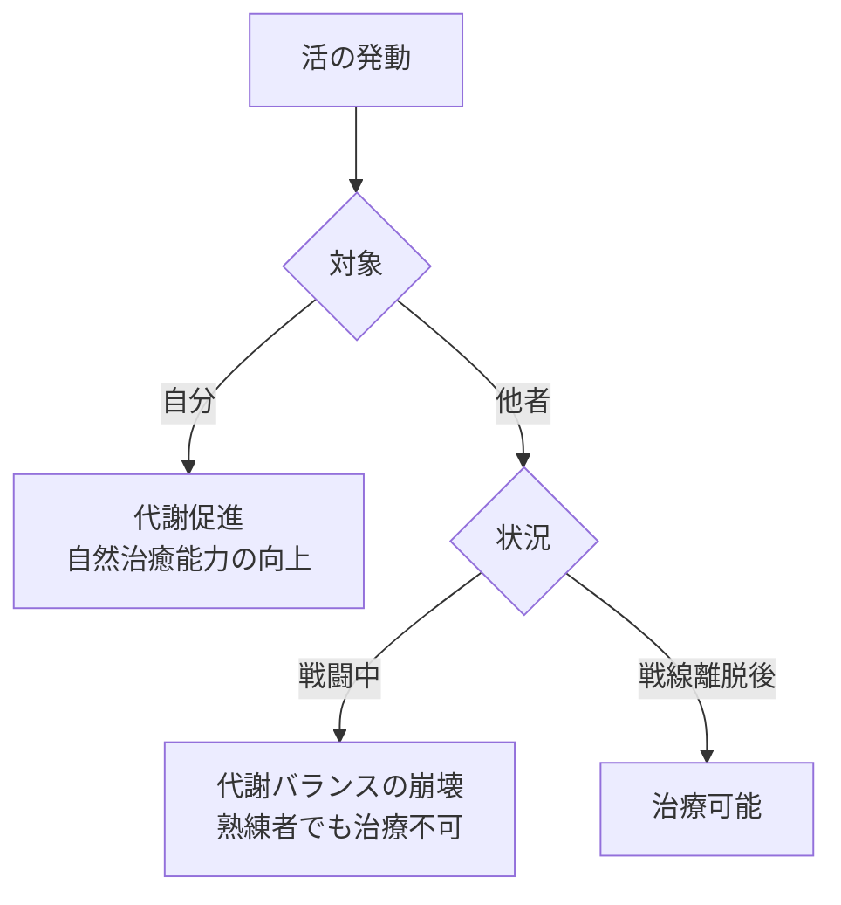

## 3. 形態変化

オムンティギアは作用を加えることで、現象または物質に変換される。

### 3.1 現象系（エネルギー→現象）

| 形態  | 操作  | 生成  | 説明                  |
| --- | --- | --- | ------------------- |
| 熱   | ○   | ○   | 既存の熱を操作、または熱を生成する   |
| 冷   | ○   | ○   | 既存の冷気を操作、または冷気を生成する |
| 光   | ○   | ○   | 既存の光を操作、または光を生成する   |
| 音   | ○   | ○   | 既存の音を操作、または音を生成する   |
| 電   | ○   | ○   | 既存の電気を操作、または電気を生成する |
| 力   | ○   | ○   | 既存の力を操作、または力を生成する   |
| 風   | ○   | ○   | 既存の気流を操作、または風を生成する  |
| 重   | ○   | ✕   | 既存の重力を操作する          |
| 斥   | ○   | ○   | 既存の反発を操作、または反発を生成する |
| 引   | ○   | ○   | 既存の吸引を操作、または吸引を生成する |
| 活   | ○   | ✕   | 自然治癒・代謝を促進する        |

#### 3.1.1 活の対象範囲

活は使用対象によって効果が異なる。

|対象|状況|効果|説明|
|---|---|---|---|
|自分|-|代謝促進・自然治癒能力の向上|身体本来の機能を強化する方向に作用する|
|他者|戦闘中|代謝バランスの崩壊|戦闘中の他者に活を使用すると、代謝バランスを崩す。熟練者であっても量の調整による戦闘中の治療は不可能|
|他者|戦線離脱後|治療可能|戦線を離脱した状態であれば、他者への治療が可能となる|

活は自分に使う場合と他者に使う場合で本質的に異なる作用をもたらす。この差異は術者の技量に依存せず、エネルギーと対象の関係性に起因するものである。自己に対して使用する場合、活のエネルギーは自身の体内で生成・循環しているため親和性が高く、戦闘中であっても身体の機能を強化する方向に作用する。一方、他者に対しては外部から注入されるエネルギーとなるため親和性が低く、特に戦闘中の身体は代謝が激しく変動しているため、活の作用が代謝バランスを崩す方向に働く。戦線を離脱し身体が安定した状態であれば、外部からのエネルギーであっても治療として機能する。

### 3.2 物質系（エネルギー→物質）

| 形態  | 操作  | 生成  | 説明                   |
| --- | --- | --- | -------------------- |
| 水   | ○   | ○   | 既存の水・液体を操作、または水を生成する |
| 土   | ○   | ○   | 既存の土・砂を操作、または土を生成する  |
| 石   | ○   | ○   | 既存の岩石を操作、または石を生成する   |
| 木   | ○   | ✕   | 既存の植物を操作する           |
| 気   | ○   | ○   | 既存の気体を操作、または気体を生成する  |

### 3.3 難易度の目安

|分類|難易度|理由|
|---|---|---|
|現象系（操作）|低〜中|既存の現象を制御|
|現象系（生成）|中|エネルギーを現象に変換|
|物質系（操作）|中〜高|既存の物質を動かす|
|物質系（生成）|高〜極高|エネルギーを物質に変換|

### 3.4 同時発動禁止

複数の形態変化を同時に発動することは不可能である。一度に使用できるのは一つの形態のみ。

例えば「熱」と「風」を同時に発動して熱風を生み出すことはできない。熱風を発生させたい場合は、まず「熱」で空気を加熱し、次に「風」で気流を起こすという順序が必要となる。

---
