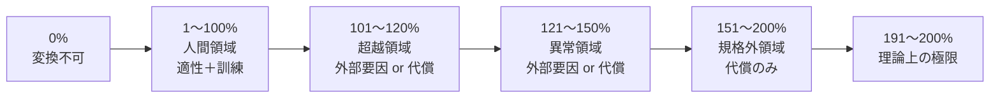

## 4. 変換率

オムンティギアを変換する際の効率を示す指標。

### 4.1 変換率リスト

|変換率|状態|条件|
|---|---|---|
|0%|変換不可|適性なし|
|1〜10%|実用外|適性のみ|
|11〜30%|初心者|適性 + 訓練|
|31〜50%|中級者|適性 + 訓練|
|51〜70%|上級者|適性 + 訓練|
|71〜90%|専門家|適性 + 訓練|
|91〜100%|達人|適性 + 訓練|
|101〜110%|超越領域・入口|外部要因 or 代償|
|111〜120%|超越領域・中域|外部要因 or 代償|
|121〜130%|異常領域・入口|外部要因 or 代償|
|131〜140%|異常領域・中域|外部要因 or 代償|
|141〜150%|異常領域・深域|外部要因 or 代償|
|151〜160%|規格外・入口|代償1個|
|161〜170%|規格外・中域|代償2個|
|171〜180%|規格外・深域|代償3個|
|181〜190%|規格外・極域|代償4個|
|191〜200%|理論上の極限|代償5個|

### 4.2 変換率の原則

適性があれば、訓練によって誰でも100%まで到達可能である。101%以降は通常の手段では到達できない領域となる。

### 4.3 適性と訓練

適性とは「最初から持っている素質」であり、いわば初期値である。適性0%の形態や操作であっても、訓練によって1%以上に引き上げ、使用可能になる場合がある。後天的な獲得は不可能ではない。

ただし、代償として適性に関わるもの（感覚器官、神経系など）を差し出した場合、その形態の適性を永久に喪失する。この場合、いかなる訓練を積んでも使用不可となる。

### 4.4 複数適性

一人が複数の形態変化に適性を持つことは可能である。ただし、全形態に完全な適性を最初から持つことはない。

変換率は形態ごとに個別に管理される。例えば、ある人物が「熱70%、水30%、光0%」というように、形態ごとに異なる変換率を持つ。各形態の変換率は、それぞれ個別に訓練で向上させる必要がある。

---
