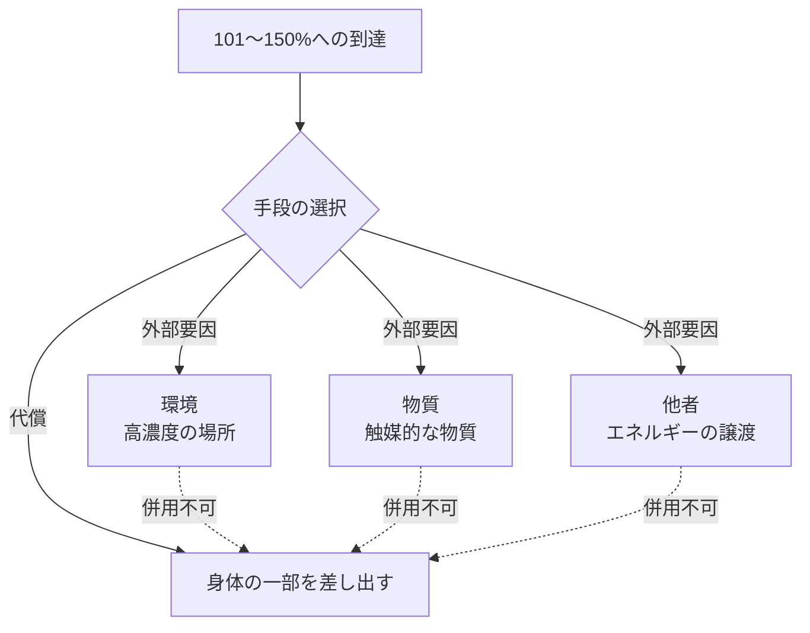

## 5. 外部要因

101〜150%の領域に到達するための条件のひとつ。外部要因と代償は併用できず、どちらか一方のみを選択する。

|種類|内容|
|---|---|
|環境|オムンティギアの濃度が高い場所にいる|
|物質|その場に特定の物質がある（触媒的な役割）|
|他者|誰かからエネルギーを分けてもらう|

外部要因による変換率の向上は、環境の濃度変化や術者のコンディションなどにより自然な揺らぎが生じる。ジェネレートのような特定の変動現象ではなく、条件が一定でないことによる不安定さである。

---
