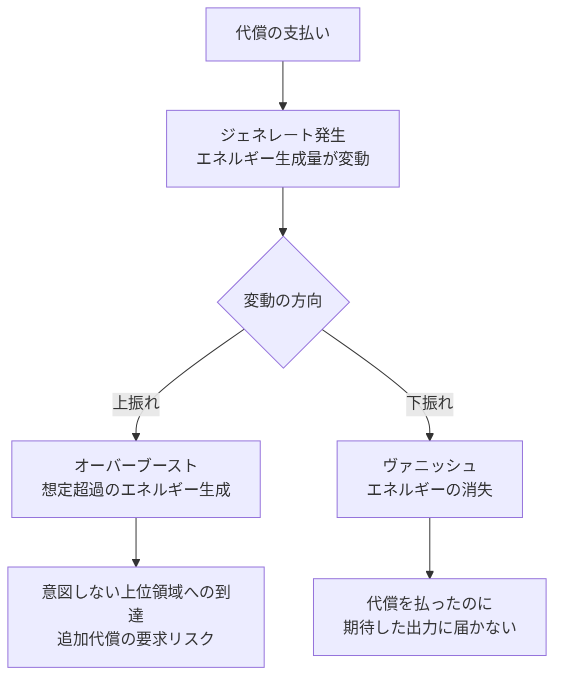
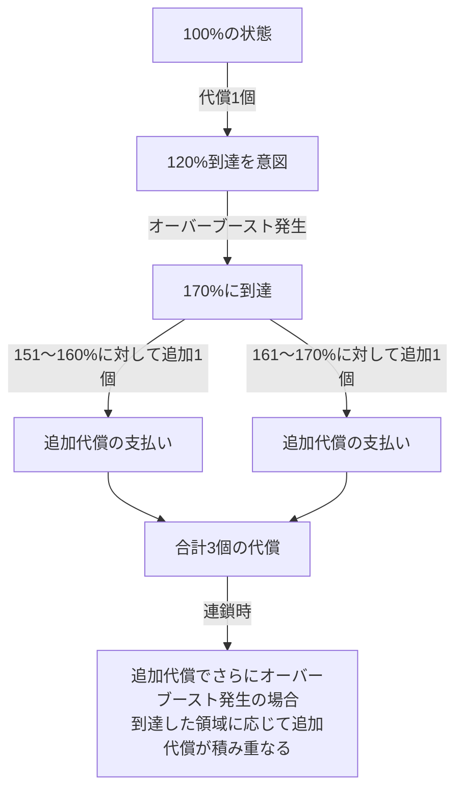

## 6. 代償

101%以降の領域に到達するためのもうひとつの条件。151%以降は代償のみが唯一の手段となる。

### 6.1 代償の性質

|項目|内容|
|---|---|
|種類|何でも可（身体部位、臓器、血液、カロリー等）|
|量|調整可能（爪1枚、胃5%など）|
|必要数|変換率に応じた個数が必要|
|不可逆性|差し出したものは二度と戻らない|

### 6.2 必要な代償個数

|変換率|必要な代償個数|
|---|---|
|101〜150%|外部要因で代替可能、代償を選ぶ場合は1個|
|151〜160%|1個|
|161〜170%|2個|
|171〜180%|3個|
|181〜190%|4個|
|191〜200%|5個|

#### 代償の個数カウント基準

代償は「何を差し出すか」ではなく「差し出すという行為」が1個としてカウントされる。爪1枚でも腕1本でも心臓10%でも、差し出せば等しく1個である。

何を差し出すかに貴賤はなく、軽いものも重いものも等価として扱われる。これにより「何を失うか」という選択に、その人の性格や価値観が表れる。

### 6.3 代償の例

| 種類   | 例                | 最小単位           |
| ---- | ---------------- | -------------- |
| 末端   | 爪1枚、髪1束、歯1本      | 爪：1枚、髪：1束、歯：1本 |
| 血液   | 100ml、200ml等     | 100ml          |
| カロリー | 100kcal、500kcal等 | 100kcal        |
| 臓器   | 胃5%、肝臓10%等       | 5%             |
| 感覚器  | 視力の一部、聴力の一部等     | 各感覚の5%         |
| 身体部位 | 指先、手、腕等          | 指先             |

カロリーを代償にした場合、摂取・取り込み可能なカロリー量の上限が永久に低下する。例えば100kcalを代償にすると、一生その分だけ食べられる量が減り、身体が取り込めるエネルギーの上限も下がる。成人男性の1日必要量は約2,000〜2,400kcal、成人女性は約1,400〜2,000kcal。

### 6.4 代償の不可逆性

代償として差し出したものは、いかなる手段を用いても回復しない。回復系の形態変化（活）でも戻せず、欠損部位の再生（物質系の超高難度技術）でも不可能である。

代償は本当の意味での「代償」であり、繰り返し使用すれば最終的に差し出すものがなくなる。

### 6.5 ジェネレート

代償を支払った際に発生する、エネルギー生成量の変動現象。代償によって得られるエネルギー量は固定値ではなく、ジェネレートによって毎回変動する。この変動には上振れも下振れもある。

|項目|内容|
|---|---|
|発生条件|代償を支払った時のみ|
|現象|エネルギー生成量が変動する|
|方向性|上振れも下振れもある|
|制御可能性|不可能。変動幅は予測も制御もできない|

ジェネレートの結果は二つの通称で呼ばれる。

|結果|通称|内容|
|---|---|---|
|上振れ|オーバーブースト|想定を超えたエネルギーが生成される|
|下振れ|ヴァニッシュ|期待したエネルギーが得られず消失する|

### 6.6 オーバーブースト

代償を支払った際に、想定を超えた出力が発生する現象の通称。発生原因は二つある。

|原因|メカニズム|性質|
|---|---|---|
|ジェネレート|エネルギー生成量の上振れ|エネルギー側の不確定性|
|防衛反応|痛みに対する身体の痛覚ストッパー等による一時的出力上昇|身体側の反応|

この二つは同時に発生する可能性がある。ジェネレートの上振れと防衛反応が重なった場合、出力は大幅に想定を超え、意図しない上位領域への到達を引き起こす。

オーバーブーストは意図的に制御できるものではなく、代償に伴う危険な副次的現象である。

### 6.7 ヴァニッシュ

代償を支払った際に、ジェネレートの下振れによって期待したエネルギーが得られない現象の通称。

身体の一部を不可逆的に差し出したにもかかわらず、リターンが想定に届かない。代償の不可逆性と合わせて、代償という行為が「払えば確実に強くなる」ものではないことを意味する。

ヴァニッシュが発生した場合、実際の出力はジェネレートの結果に応じた領域に留まる。例えば、151%（規格外）を目指して代償を支払ったが、ヴァニッシュにより120%相当の出力しか得られなかった場合、その術者は120%（異常領域）に留まる。151%の領域には到達していない。

この場合、支払った代償は戻らない。代償の個数としては120%に対して過剰であっても、差し出したものは不可逆的に失われる。これがヴァニッシュの最も残酷な側面である。

### 6.8 代償の段階性

101〜150%の代償と151%以降の代償は別枠として扱う。代償は新たに踏み込んだ領域ごとに追加で要求され、既に支払った分は差し引かれない。

例えば、120%到達のために代償1個を差し出し、その際のオーバーブーストで170%に到達した場合、追加代償は以下の通り要求される。151〜160%の領域に対して追加1個、161〜170%の領域に対してさらに追加1個。最初の1個と合わせて合計3個の代償を支払うことになる。

オーバーブーストの連鎖が発生した場合も同様である。追加代償を支払った際にさらにオーバーブーストが起き、さらに上位の領域に到達した場合、到達した領域に応じた追加代償が要求される。連鎖はその分だけ支払いが積み重なる。

連鎖により代償が要求された際、支払える部位が残っていない場合、術者は即死する。代償の要求は免除されない。

### 6.9 代償の選択と戦略

代償は自分で選択できる。何を差し出すかは本人の意思に委ねられる。

ここに戦略的なジレンマが生じる。軽い代償（爪、髪束など）から使えば当面は楽だが、最終的に重要な部位しか残らない。重い代償（腕、臓器など）を先に使えば後が楽だが、早期に身体機能が低下する。

代償を繰り返すほど「次に失えるもの」が減り、最後は生命維持に関わる部位しか残らない。

### 6.10 致死的代償

心臓100%、脳100%など、即死する代償も実行可能である。

代償の処理は「身体の喪失→エネルギー生成→変換」の順序で進行する。致死的代償の場合、最初の段階で生命活動が停止するため、エネルギー生成に到達する前に絶命する。結果として、致死的代償には実質的な意味がない。

---
