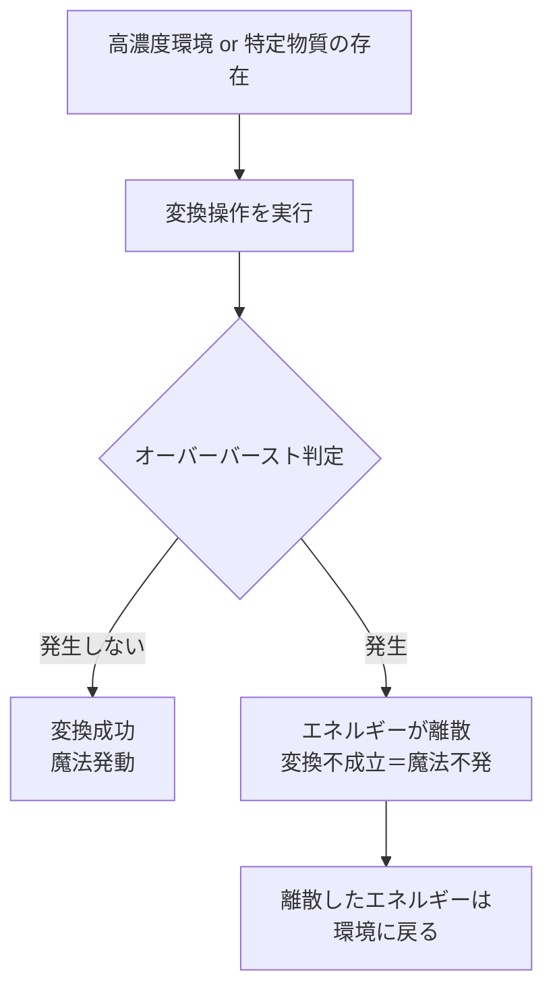
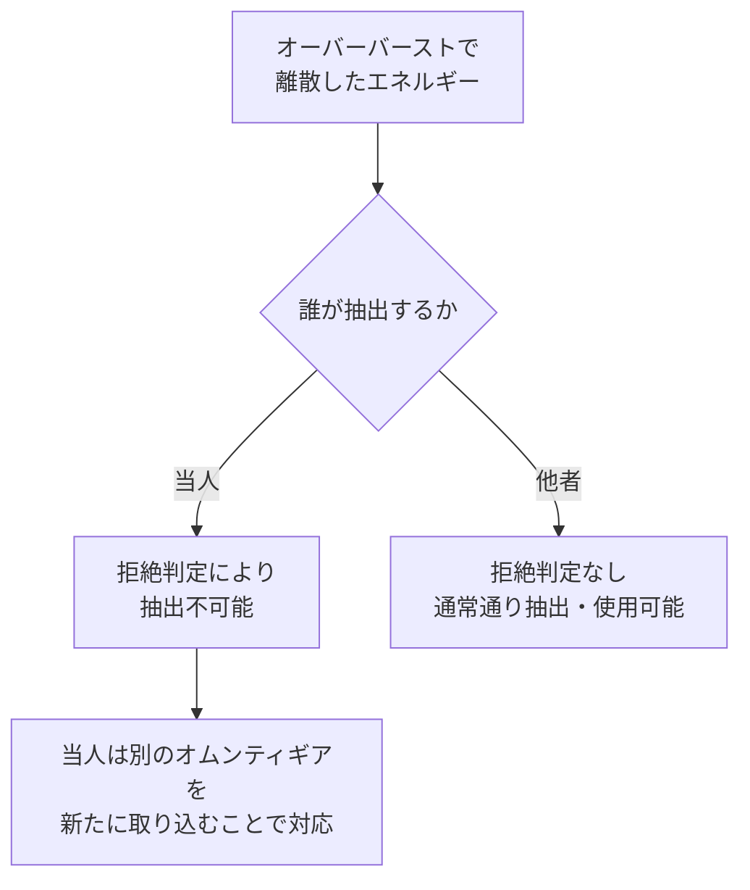

## 7. オーバーバースト

オムンティギアが高濃度で集まっている環境、もしくは特定の物質が存在する場所で時々発生する離散現象。オーバーバーストが発生した場合、エネルギーの変換が成立しない。これは魔法が発動しないことと同義である。

### 7.1 発生条件と現象

|項目|内容|
|---|---|
|発生場所|オムンティギア高濃度環境、または特定物質が存在する場所|
|発生タイミング|変換操作の実行時（変換途中を含む）|
|現象|エネルギーが離散し、変換が成立しない|
|予測可能性|不可能。いつ起こるか分からない|
|蓄積状態への影響|なし。蓄積しているだけでは離散しない|

オーバーバーストは変換という行為そのものがトリガーとなる。体内にエネルギーを蓄積しているだけの状態では離散は起きないが、変換操作を実行した瞬間、あるいは変換の途中で、エネルギーが離散する可能性がある。

いつ発生するかは一切予測できない。傾向も法則もなく、同じ場所・同じ条件で発生する時もあれば発生しない時もある。

### 7.2 離散エネルギーの性質

オーバーバーストで離散したエネルギーには、離散させた当人との間に拒絶判定が発生する。

|項目|内容|
|---|---|
|離散後の行き先|環境に戻る|
|当人による再抽出|不可能。そのエネルギーと当人の間に拒絶判定が発生する|
|当人の能力への影響|なし。別のオムンティギアは通常通り取り込める|
|他者による回収|可能。拒絶判定は当人との間のみに発生する|

拒絶判定はエネルギーと当人の関係性において発生するものであり、当人の取り込み能力が損なわれるわけではない。環境中の別のオムンティギアは問題なく取り込める。また、他者にとってはそのエネルギーに拒絶判定は存在しないため、通常通り抽出・使用が可能である。

---
